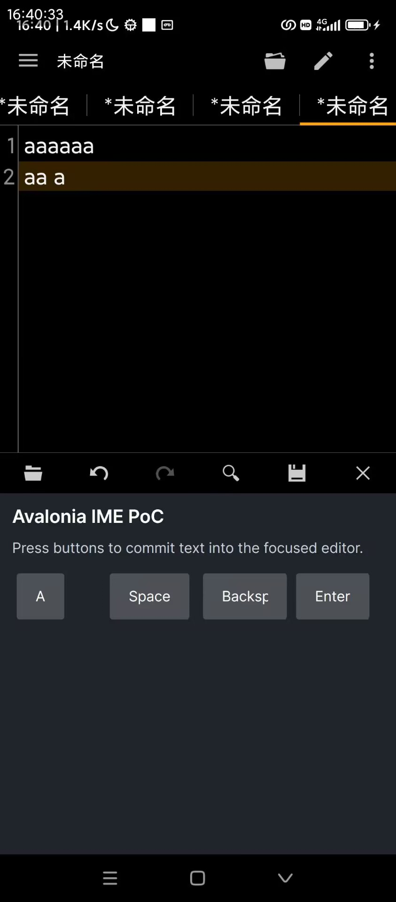
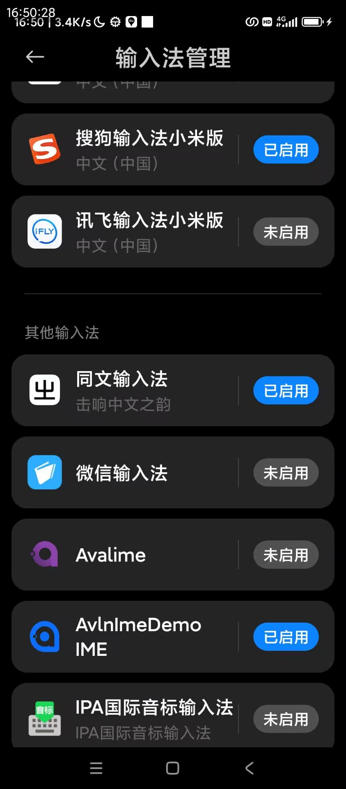

[繁體中文](./README-zh-Hant.md) [简体中文](./README-zh-Hans.md)

## Avalonia Android IME Proof of Concept

This project is a proof of concept, demonstrating the feasibility of building an Android input method using Avalonia. The build output is a minimal demo — not a production-ready input method.

### Dependencies

- NET 10
- Avalonia 12

## Screenshots

Pressing the `a` key commits the character `a`. The spacebar, backspace, and enter keys all function correctly.

## Try It on Your Own Device

### Prerequisites

1. .NET 10 SDK installed
2. ADB connected to your device

### Steps

1. Clone the repository

1. Build and run
   ```bash
   cd AvlnImeDemo.Android
   dotnet run
   ```
2. Enable the input method in your phone’s input method settings
   
3. Select the input method
4. Focus on an input field — the IME UI will appear

## Key AI Prompts

This project was built entirely by AI. The main prompts used are shown below.

```typ
Look at AvlnImeDemo.Android.csproj.
This project was created with `dotnet new avalonia.xplat`. Not a single line of code has been touched since creation.
After connecting via adb, running `dotnet run` in the Android project gets the app running on my phone.

Now I want to do a proof of concept — to see if Avalonia can be used to build an Android input method.
Figure out how to register it as an Android IME. When an input field is focused, the IME UI should appear. Pressing keys should commit text.

This is just a proof of concept. The keyboard UI can be simple — just a letter key as an example, plus enter and backspace.
Or other special keys you think are worth trying.

If you don't know how to do something, look it up online.
No native Views — the UI must be cross-platform.

**If you run into ANY doubt or uncertainty, stop immediately and check with me!** This includes:

- Things you're unsure about
- Things you think have design issues
  - For example, if implementing a given feature in the current framework feels awkward or difficult, you should stop and confirm with me — it might be a design mistake on my end. Don't push through blindly.

**Ask often — don't work while carrying doubts.**
```

```typst
On Avalonia Android, you should have access to the full .NET for Android API.
If you can't find a certain API in the Avalonia docs, search the .NET for Android docs.
```

```typst
The IME is taking up the full screen when it pops up. Adjust the height to half-screen.
```
